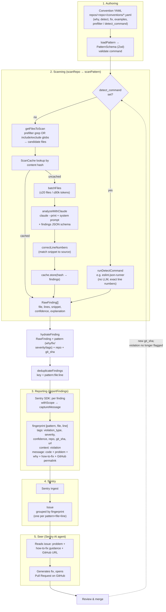

# Data flow: convention → Sentry issue → Seer PR

How a convention definition becomes a flagged violation, a Sentry issue, and
ultimately an automated fix PR.

## Notes

- **Two detection paths.** A convention either bypasses the LLM via
  `detect_command` (e.g. an ESLint rule — fast, exact line numbers) or uses the
  LLM path: a `prefilter` grep (or `include`/`exclude` globs) narrows candidate
  files, then `analyzeWithClaude` judges each batch against the convention's
  `detect`/`examples`. `no-class-components` uses the LLM path with a grep
  prefilter for `extends (React.)?(Pure)?Component`.
- **Caching.** Findings are cached by file content hash, so re-scans only call
  the LLM on changed files.
- **Hydration** merges the per-file `RawFinding` (from LLM or lint tool) with the
  static convention metadata (`why`, `fix`, `severity`, `tags`) plus `repo` and
  `git_sha`, producing the `ScanFinding` that gets reported.
- **Fingerprinting** (`pattern:file:line`) controls Sentry grouping: each
  distinct violation site becomes its own issue, and re-reporting the same site
  reopens/updates rather than duplicates.
- **Seer** is a Sentry product feature, not part of this repo. It consumes the
  issue — the "How to fix" section and the GitHub permalink give it the context
  to generate a fix and open a PR.
